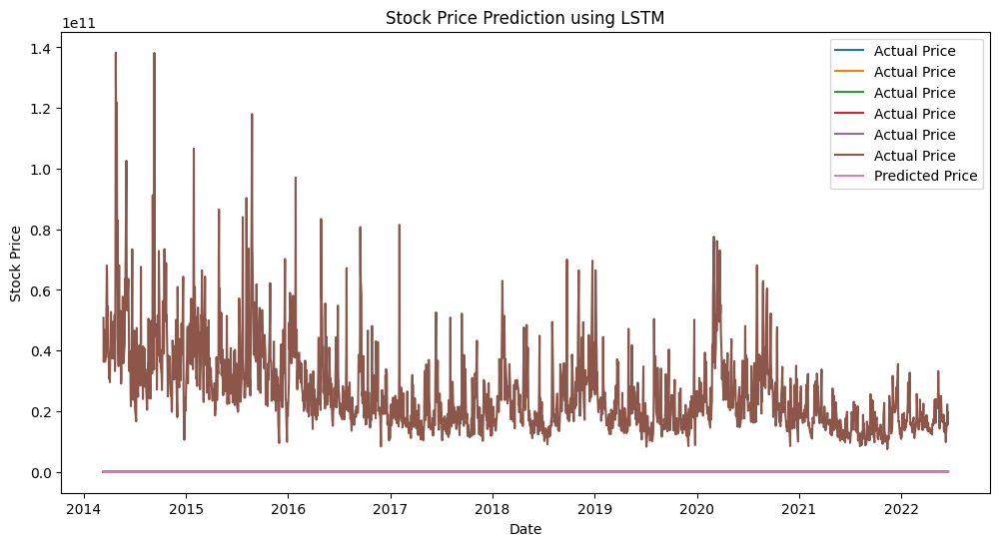

```python
pip install numpy pandas matplotlib tensorflow
```

    Requirement already satisfied: numpy in c:\users\anitha\appdata\local\programs\python\python311\lib\site-packages (1.24.3)Note: you may need to restart the kernel to use updated packages.
    
    Requirement already satisfied: pandas in c:\users\anitha\appdata\local\programs\python\python311\lib\site-packages (2.0.3)
    Requirement already satisfied: matplotlib in c:\users\anitha\appdata\local\programs\python\python311\lib\site-packages (3.7.2)
    Requirement already satisfied: tensorflow in c:\users\anitha\appdata\local\programs\python\python311\lib\site-packages (2.13.0)
    Requirement already satisfied: python-dateutil>=2.8.2 in c:\users\anitha\appdata\local\programs\python\python311\lib\site-packages (from pandas) (2.8.2)
    Requirement already satisfied: pytz>=2020.1 in c:\users\anitha\appdata\local\programs\python\python311\lib\site-packages (from pandas) (2023.3)
    Requirement already satisfied: tzdata>=2022.1 in c:\users\anitha\appdata\local\programs\python\python311\lib\site-packages (from pandas) (2023.3)
    Requirement already satisfied: contourpy>=1.0.1 in c:\users\anitha\appdata\local\programs\python\python311\lib\site-packages (from matplotlib) (1.1.0)
    Requirement already satisfied: cycler>=0.10 in c:\users\anitha\appdata\local\programs\python\python311\lib\site-packages (from matplotlib) (0.11.0)
    Requirement already satisfied: fonttools>=4.22.0 in c:\users\anitha\appdata\local\programs\python\python311\lib\site-packages (from matplotlib) (4.41.1)
    Requirement already satisfied: kiwisolver>=1.0.1 in c:\users\anitha\appdata\local\programs\python\python311\lib\site-packages (from matplotlib) (1.4.4)
    Requirement already satisfied: packaging>=20.0 in c:\users\anitha\appdata\local\programs\python\python311\lib\site-packages (from matplotlib) (23.1)
    Requirement already satisfied: pillow>=6.2.0 in c:\users\anitha\appdata\local\programs\python\python311\lib\site-packages (from matplotlib) (10.0.0)
    Requirement already satisfied: pyparsing<3.1,>=2.3.1 in c:\users\anitha\appdata\local\programs\python\python311\lib\site-packages (from matplotlib) (3.0.9)
    Requirement already satisfied: tensorflow-intel==2.13.0 in c:\users\anitha\appdata\local\programs\python\python311\lib\site-packages (from tensorflow) (2.13.0)
    Requirement already satisfied: absl-py>=1.0.0 in c:\users\anitha\appdata\local\programs\python\python311\lib\site-packages (from tensorflow-intel==2.13.0->tensorflow) (1.4.0)
    Requirement already satisfied: astunparse>=1.6.0 in c:\users\anitha\appdata\local\programs\python\python311\lib\site-packages (from tensorflow-intel==2.13.0->tensorflow) (1.6.3)
    Requirement already satisfied: flatbuffers>=23.1.21 in c:\users\anitha\appdata\local\programs\python\python311\lib\site-packages (from tensorflow-intel==2.13.0->tensorflow) (23.5.26)
    Requirement already satisfied: gast<=0.4.0,>=0.2.1 in c:\users\anitha\appdata\local\programs\python\python311\lib\site-packages (from tensorflow-intel==2.13.0->tensorflow) (0.4.0)
    Requirement already satisfied: google-pasta>=0.1.1 in c:\users\anitha\appdata\local\programs\python\python311\lib\site-packages (from tensorflow-intel==2.13.0->tensorflow) (0.2.0)
    Requirement already satisfied: h5py>=2.9.0 in c:\users\anitha\appdata\local\programs\python\python311\lib\site-packages (from tensorflow-intel==2.13.0->tensorflow) (3.9.0)
    Requirement already satisfied: libclang>=13.0.0 in c:\users\anitha\appdata\local\programs\python\python311\lib\site-packages (from tensorflow-intel==2.13.0->tensorflow) (16.0.6)
    Requirement already satisfied: opt-einsum>=2.3.2 in c:\users\anitha\appdata\local\programs\python\python311\lib\site-packages (from tensorflow-intel==2.13.0->tensorflow) (3.3.0)
    Requirement already satisfied: protobuf!=4.21.0,!=4.21.1,!=4.21.2,!=4.21.3,!=4.21.4,!=4.21.5,<5.0.0dev,>=3.20.3 in c:\users\anitha\appdata\local\programs\python\python311\lib\site-packages (from tensorflow-intel==2.13.0->tensorflow) (4.23.4)
    Requirement already satisfied: setuptools in c:\users\anitha\appdata\local\programs\python\python311\lib\site-packages (from tensorflow-intel==2.13.0->tensorflow) (65.5.0)
    Requirement already satisfied: six>=1.12.0 in c:\users\anitha\appdata\local\programs\python\python311\lib\site-packages (from tensorflow-intel==2.13.0->tensorflow) (1.16.0)
    Requirement already satisfied: termcolor>=1.1.0 in c:\users\anitha\appdata\local\programs\python\python311\lib\site-packages (from tensorflow-intel==2.13.0->tensorflow) (2.3.0)
    Requirement already satisfied: typing-extensions<4.6.0,>=3.6.6 in c:\users\anitha\appdata\local\programs\python\python311\lib\site-packages (from tensorflow-intel==2.13.0->tensorflow) (4.5.0)
    Requirement already satisfied: wrapt>=1.11.0 in c:\users\anitha\appdata\local\programs\python\python311\lib\site-packages (from tensorflow-intel==2.13.0->tensorflow) (1.15.0)
    Requirement already satisfied: grpcio<2.0,>=1.24.3 in c:\users\anitha\appdata\local\programs\python\python311\lib\site-packages (from tensorflow-intel==2.13.0->tensorflow) (1.56.2)
    Requirement already satisfied: tensorboard<2.14,>=2.13 in c:\users\anitha\appdata\local\programs\python\python311\lib\site-packages (from tensorflow-intel==2.13.0->tensorflow) (2.13.0)
    Requirement already satisfied: tensorflow-estimator<2.14,>=2.13.0 in c:\users\anitha\appdata\local\programs\python\python311\lib\site-packages (from tensorflow-intel==2.13.0->tensorflow) (2.13.0)
    Requirement already satisfied: keras<2.14,>=2.13.1 in c:\users\anitha\appdata\local\programs\python\python311\lib\site-packages (from tensorflow-intel==2.13.0->tensorflow) (2.13.1)
    Requirement already satisfied: tensorflow-io-gcs-filesystem>=0.23.1 in c:\users\anitha\appdata\local\programs\python\python311\lib\site-packages (from tensorflow-intel==2.13.0->tensorflow) (0.31.0)
    Requirement already satisfied: wheel<1.0,>=0.23.0 in c:\users\anitha\appdata\local\programs\python\python311\lib\site-packages (from astunparse>=1.6.0->tensorflow-intel==2.13.0->tensorflow) (0.41.0)
    Requirement already satisfied: google-auth<3,>=1.6.3 in c:\users\anitha\appdata\local\programs\python\python311\lib\site-packages (from tensorboard<2.14,>=2.13->tensorflow-intel==2.13.0->tensorflow) (2.22.0)
    Requirement already satisfied: google-auth-oauthlib<1.1,>=0.5 in c:\users\anitha\appdata\local\programs\python\python311\lib\site-packages (from tensorboard<2.14,>=2.13->tensorflow-intel==2.13.0->tensorflow) (1.0.0)
    Requirement already satisfied: markdown>=2.6.8 in c:\users\anitha\appdata\local\programs\python\python311\lib\site-packages (from tensorboard<2.14,>=2.13->tensorflow-intel==2.13.0->tensorflow) (3.4.4)
    Requirement already satisfied: requests<3,>=2.21.0 in c:\users\anitha\appdata\local\programs\python\python311\lib\site-packages (from tensorboard<2.14,>=2.13->tensorflow-intel==2.13.0->tensorflow) (2.31.0)
    Requirement already satisfied: tensorboard-data-server<0.8.0,>=0.7.0 in c:\users\anitha\appdata\local\programs\python\python311\lib\site-packages (from tensorboard<2.14,>=2.13->tensorflow-intel==2.13.0->tensorflow) (0.7.1)
    Requirement already satisfied: werkzeug>=1.0.1 in c:\users\anitha\appdata\local\programs\python\python311\lib\site-packages (from tensorboard<2.14,>=2.13->tensorflow-intel==2.13.0->tensorflow) (2.3.6)
    Requirement already satisfied: cachetools<6.0,>=2.0.0 in c:\users\anitha\appdata\local\programs\python\python311\lib\site-packages (from google-auth<3,>=1.6.3->tensorboard<2.14,>=2.13->tensorflow-intel==2.13.0->tensorflow) (5.3.1)
    Requirement already satisfied: pyasn1-modules>=0.2.1 in c:\users\anitha\appdata\local\programs\python\python311\lib\site-packages (from google-auth<3,>=1.6.3->tensorboard<2.14,>=2.13->tensorflow-intel==2.13.0->tensorflow) (0.3.0)
    Requirement already satisfied: rsa<5,>=3.1.4 in c:\users\anitha\appdata\local\programs\python\python311\lib\site-packages (from google-auth<3,>=1.6.3->tensorboard<2.14,>=2.13->tensorflow-intel==2.13.0->tensorflow) (4.9)
    Requirement already satisfied: urllib3<2.0 in c:\users\anitha\appdata\local\programs\python\python311\lib\site-packages (from google-auth<3,>=1.6.3->tensorboard<2.14,>=2.13->tensorflow-intel==2.13.0->tensorflow) (1.26.16)
    Requirement already satisfied: requests-oauthlib>=0.7.0 in c:\users\anitha\appdata\local\programs\python\python311\lib\site-packages (from google-auth-oauthlib<1.1,>=0.5->tensorboard<2.14,>=2.13->tensorflow-intel==2.13.0->tensorflow) (1.3.1)
    Requirement already satisfied: charset-normalizer<4,>=2 in c:\users\anitha\appdata\local\programs\python\python311\lib\site-packages (from requests<3,>=2.21.0->tensorboard<2.14,>=2.13->tensorflow-intel==2.13.0->tensorflow) (3.2.0)
    Requirement already satisfied: idna<4,>=2.5 in c:\users\anitha\appdata\local\programs\python\python311\lib\site-packages (from requests<3,>=2.21.0->tensorboard<2.14,>=2.13->tensorflow-intel==2.13.0->tensorflow) (3.4)
    Requirement already satisfied: certifi>=2017.4.17 in c:\users\anitha\appdata\local\programs\python\python311\lib\site-packages (from requests<3,>=2.21.0->tensorboard<2.14,>=2.13->tensorflow-intel==2.13.0->tensorflow) (2023.7.22)
    Requirement already satisfied: MarkupSafe>=2.1.1 in c:\users\anitha\appdata\local\programs\python\python311\lib\site-packages (from werkzeug>=1.0.1->tensorboard<2.14,>=2.13->tensorflow-intel==2.13.0->tensorflow) (2.1.3)
    Requirement already satisfied: pyasn1<0.6.0,>=0.4.6 in c:\users\anitha\appdata\local\programs\python\python311\lib\site-packages (from pyasn1-modules>=0.2.1->google-auth<3,>=1.6.3->tensorboard<2.14,>=2.13->tensorflow-intel==2.13.0->tensorflow) (0.5.0)
    Requirement already satisfied: oauthlib>=3.0.0 in c:\users\anitha\appdata\local\programs\python\python311\lib\site-packages (from requests-oauthlib>=0.7.0->google-auth-oauthlib<1.1,>=0.5->tensorboard<2.14,>=2.13->tensorflow-intel==2.13.0->tensorflow) (3.2.2)
    

    
    [notice] A new release of pip is available: 23.2 -> 23.2.1
    [notice] To update, run: python.exe -m pip install --upgrade pip
    


```python
import numpy as np
import pandas as pd
import matplotlib.pyplot as plt
from sklearn.preprocessing import MinMaxScaler
from tensorflow.keras.models import Sequential
from tensorflow.keras.layers import LSTM, Dense

# Replace 'AAPL.csv' with the CSV file containing the historical stock price data of the company you want to predict.
# The CSV file should have a column 'Date' and 'Close' containing the date and closing prices respectively.
path="C:\\Users\\Anitha\\Downloads\\archive (2)\\AAPL.csv"
data = pd.read_csv(path)
data['Date'] = pd.to_datetime(data['Date'])
data.set_index('Date', inplace=True)

# Normalize the data
scaler = MinMaxScaler()
data['Close'] = scaler.fit_transform(data['Close'].values.reshape(-1, 1))

# Split the data into training and test sets
train_size = int(len(data) * 0.8)
train_data, test_data = data[:train_size], data[train_size:]

# Create sequences of data for LSTM training
def create_sequences(data, sequence_length):
    sequences = []
    for i in range(len(data) - sequence_length):
        sequences.append(data[i:i+sequence_length])
    return np.array(sequences)

sequence_length = 10  # You can adjust this value based on the number of time steps to consider for predictions

train_sequences = create_sequences(train_data, sequence_length)
test_sequences = create_sequences(test_data, sequence_length)

# Split input and target data
X_train, y_train = train_sequences[:, :-1], train_sequences[:, -1]
X_test, y_test = test_sequences[:, :-1], test_sequences[:, -1]

# Build the LSTM model
model = Sequential()
model.add(LSTM(50, input_shape=(X_train.shape[1], X_train.shape[2])))
model.add(Dense(1))
model.compile(loss='mean_squared_error', optimizer='adam')
model.summary()

# Train the model
model.fit(X_train, y_train, epochs=50, batch_size=16, verbose=2)

# ... (previous code)

# Make predictions on the test data
y_pred = model.predict(X_test)

# Rescale the predictions and actual prices back to the original scale
y_pred_rescaled = scaler.inverse_transform(y_pred)
y_test_rescaled = scaler.inverse_transform(y_test)

# Get the index of the test data
test_index = data.index[train_size + sequence_length : train_size + sequence_length + len(y_test_rescaled)]

# Plot the actual vs. predicted prices
plt.figure(figsize=(12, 6))
plt.plot(test_index, y_test_rescaled, label='Actual Price')
plt.plot(test_index, y_pred_rescaled, label='Predicted Price')
plt.legend()
plt.xlabel('Date')
plt.ylabel('Stock Price')
plt.title('Stock Price Prediction using LSTM')
plt.show()


```

    Model: "sequential_4"
    _________________________________________________________________
     Layer (type)                Output Shape              Param #   
    =================================================================
     lstm_4 (LSTM)               (None, 50)                11400     
                                                                     
     dense_4 (Dense)             (None, 1)                 51        
                                                                     
    =================================================================
    Total params: 11451 (44.73 KB)
    Trainable params: 11451 (44.73 KB)
    Non-trainable params: 0 (0.00 Byte)
    _________________________________________________________________
    Epoch 1/50
    523/523 - 2s - loss: 45637867220762624.0000 - 2s/epoch - 5ms/step
    Epoch 2/50
    523/523 - 1s - loss: 45637828566056960.0000 - 1s/epoch - 2ms/step
    Epoch 3/50
    523/523 - 1s - loss: 45637888695599104.0000 - 1s/epoch - 2ms/step
    Epoch 4/50
    523/523 - 1s - loss: 45637892990566400.0000 - 1s/epoch - 2ms/step
    Epoch 5/50
    523/523 - 1s - loss: 45637850040893440.0000 - 1s/epoch - 2ms/step
    Epoch 6/50
    523/523 - 1s - loss: 45637862925795328.0000 - 1s/epoch - 2ms/step
    Epoch 7/50
    523/523 - 1s - loss: 45637837155991552.0000 - 1s/epoch - 2ms/step
    Epoch 8/50
    523/523 - 1s - loss: 45637862925795328.0000 - 1s/epoch - 2ms/step
    Epoch 9/50
    523/523 - 1s - loss: 45637858630828032.0000 - 1s/epoch - 2ms/step
    Epoch 10/50
    523/523 - 1s - loss: 45637811386187776.0000 - 1s/epoch - 2ms/step
    Epoch 11/50
    523/523 - 1s - loss: 45637845745926144.0000 - 1s/epoch - 2ms/step
    Epoch 12/50
    523/523 - 1s - loss: 45637880105664512.0000 - 1s/epoch - 2ms/step
    Epoch 13/50
    523/523 - 1s - loss: 45637815681155072.0000 - 1s/epoch - 2ms/step
    Epoch 14/50
    523/523 - 1s - loss: 45637828566056960.0000 - 1s/epoch - 2ms/step
    Epoch 15/50
    523/523 - 1s - loss: 45637841450958848.0000 - 1s/epoch - 2ms/step
    Epoch 16/50
    523/523 - 1s - loss: 45637837155991552.0000 - 1s/epoch - 2ms/step
    Epoch 17/50
    523/523 - 1s - loss: 45637824271089664.0000 - 1s/epoch - 2ms/step
    Epoch 18/50
    523/523 - 1s - loss: 45637871515729920.0000 - 1s/epoch - 2ms/step
    Epoch 19/50
    523/523 - 1s - loss: 45637828566056960.0000 - 1s/epoch - 2ms/step
    Epoch 20/50
    523/523 - 1s - loss: 45637832861024256.0000 - 1s/epoch - 2ms/step
    Epoch 21/50
    523/523 - 1s - loss: 45637845745926144.0000 - 1s/epoch - 2ms/step
    Epoch 22/50
    523/523 - 1s - loss: 45637841450958848.0000 - 1s/epoch - 2ms/step
    Epoch 23/50
    523/523 - 1s - loss: 45637858630828032.0000 - 1s/epoch - 2ms/step
    Epoch 24/50
    523/523 - 1s - loss: 45637845745926144.0000 - 1s/epoch - 2ms/step
    Epoch 25/50
    523/523 - 1s - loss: 45637871515729920.0000 - 1s/epoch - 2ms/step
    Epoch 26/50
    523/523 - 1s - loss: 45637837155991552.0000 - 1s/epoch - 2ms/step
    Epoch 27/50
    523/523 - 1s - loss: 45637837155991552.0000 - 1s/epoch - 2ms/step
    Epoch 28/50
    523/523 - 1s - loss: 45637824271089664.0000 - 1s/epoch - 2ms/step
    Epoch 29/50
    523/523 - 1s - loss: 45637824271089664.0000 - 1s/epoch - 2ms/step
    Epoch 30/50
    523/523 - 1s - loss: 45637837155991552.0000 - 1s/epoch - 2ms/step
    Epoch 31/50
    523/523 - 1s - loss: 45637828566056960.0000 - 1s/epoch - 2ms/step
    Epoch 32/50
    523/523 - 1s - loss: 45637862925795328.0000 - 1s/epoch - 2ms/step
    Epoch 33/50
    523/523 - 1s - loss: 45637819976122368.0000 - 1s/epoch - 2ms/step
    Epoch 34/50
    523/523 - 1s - loss: 45637832861024256.0000 - 1s/epoch - 2ms/step
    Epoch 35/50
    523/523 - 1s - loss: 45637858630828032.0000 - 1s/epoch - 2ms/step
    Epoch 36/50
    523/523 - 1s - loss: 45637837155991552.0000 - 1s/epoch - 2ms/step
    Epoch 37/50
    523/523 - 1s - loss: 45637832861024256.0000 - 1s/epoch - 2ms/step
    Epoch 38/50
    523/523 - 1s - loss: 45637841450958848.0000 - 1s/epoch - 2ms/step
    Epoch 39/50
    523/523 - 1s - loss: 45637832861024256.0000 - 1s/epoch - 2ms/step
    Epoch 40/50
    523/523 - 1s - loss: 45637841450958848.0000 - 1s/epoch - 2ms/step
    Epoch 41/50
    523/523 - 1s - loss: 45637837155991552.0000 - 1s/epoch - 2ms/step
    Epoch 42/50
    523/523 - 1s - loss: 45637850040893440.0000 - 1s/epoch - 2ms/step
    Epoch 43/50
    523/523 - 1s - loss: 45637832861024256.0000 - 1s/epoch - 2ms/step
    Epoch 44/50
    523/523 - 1s - loss: 45637850040893440.0000 - 1s/epoch - 2ms/step
    Epoch 45/50
    523/523 - 1s - loss: 45637841450958848.0000 - 1s/epoch - 2ms/step
    Epoch 46/50
    523/523 - 1s - loss: 45637837155991552.0000 - 1s/epoch - 2ms/step
    Epoch 47/50
    523/523 - 1s - loss: 45637815681155072.0000 - 1s/epoch - 2ms/step
    Epoch 48/50
    523/523 - 1s - loss: 45637845745926144.0000 - 1s/epoch - 2ms/step
    Epoch 49/50
    523/523 - 1s - loss: 45637798501285888.0000 - 1s/epoch - 2ms/step
    Epoch 50/50
    523/523 - 1s - loss: 45637832861024256.0000 - 1s/epoch - 2ms/step
    66/66 [==============================] - 0s 1ms/step
    


    

    

